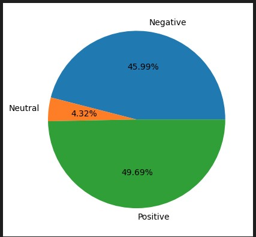

# Data Analysis:
- Data Collecting: The UIT-VSFC corpus over 16,000 sentences
 
- Familiarize with Data:
  + Understand the structure of the data: 16175 row, 3 columns
   

  + Check data types of each column. 
   

 
- Conduct data analysis to better understand your dataset:
  + Sentiment:
   	+ 0 : Negative
   	+ 1 : Neutral
   	+ 2 : Positive
  + Topic: 
      + 0 : Lecture
      + 1 : Curriculum
      + 2 : Facility
      + 3: Other
- Percentage of student feedback:
 + 
 + 