# Processing Data
- Proplem:
   + Stop words,
   + Punctuation
   + Pro noun, 
   + Spell correct word, 
   + Translate English to Vietnamese
   + Icon 
     + Translate emoticon to Vietnamese
     + Emoticon
     + Emoji
     + 
# Work it out:
- Removes 
   + Stop words:
      + Before
      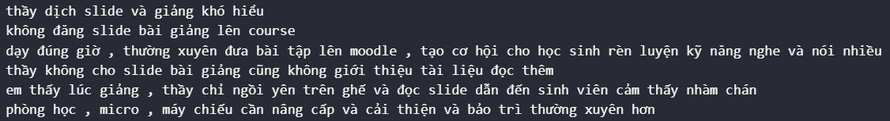
      + After
      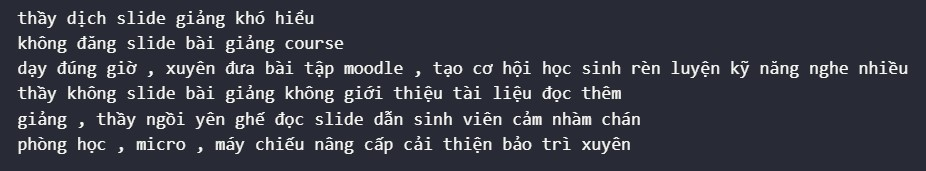

   + Punctuation:
      + Before
      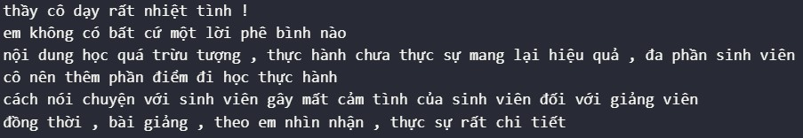
      + After
      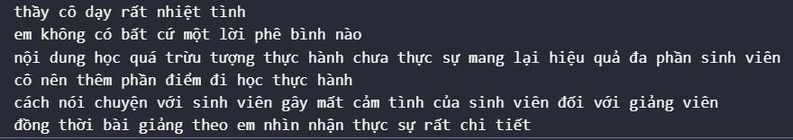

   + Pro noun:
      + Before
      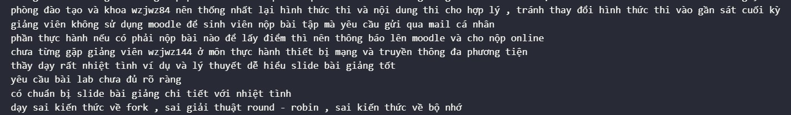
      + After
      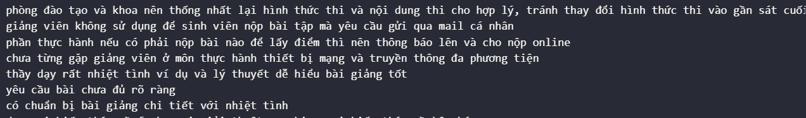

			
 
- Keep: Some express feeling
   + Spell correct word:
      + Before
      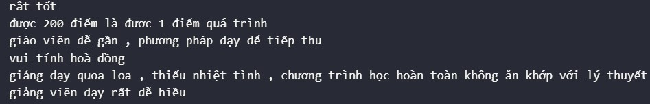
      + After
      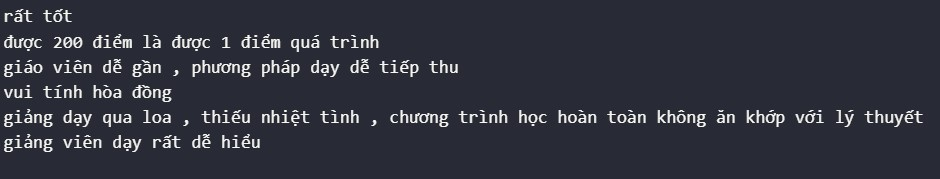

   + Translate English to Vietnamese:
      + Before
      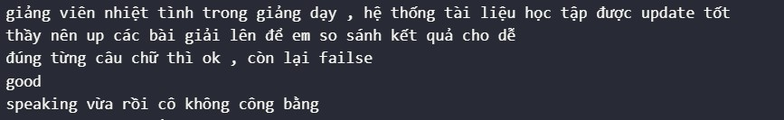
      + After
      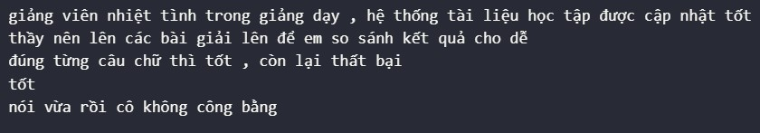

    + Icon:
      + Before
      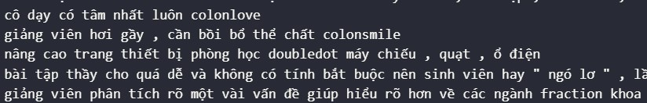
      + After
      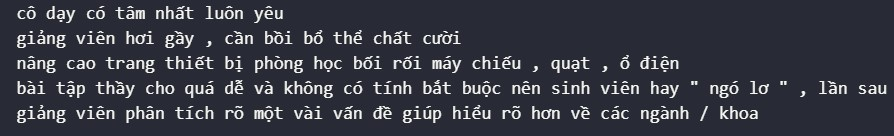

